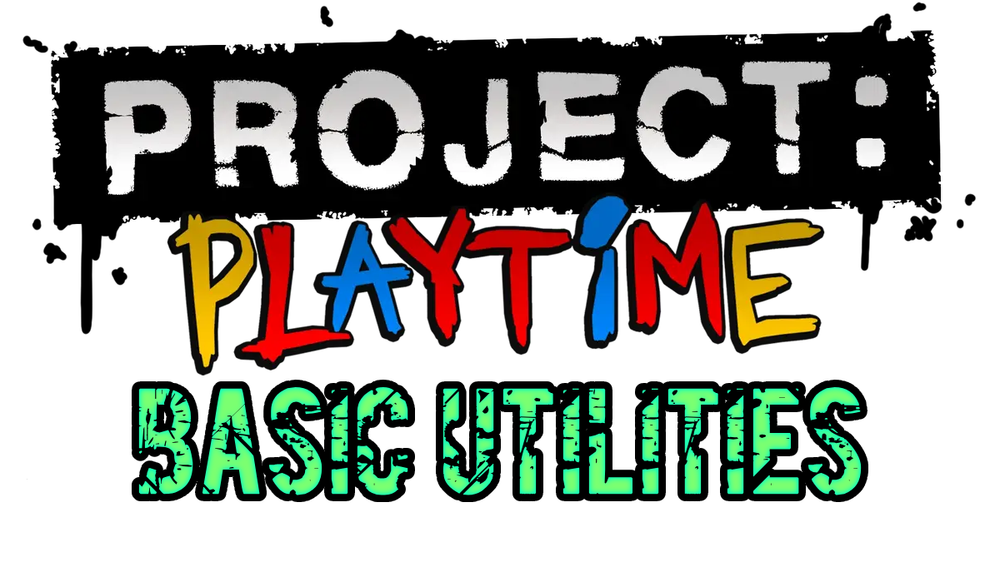

  

A mod that I made for Project: Playtime (Phase 2 Version 2.0.3), which simply adds some small useful things that are always nice to have, without anything that changes the game or gameplay significantly, this mod is basically my [Balanced Utilities](https://github.com/Jarusko12/PJPT-Balanced-Utilities) mod but without gameplay changes. Post suggestions/feedback/bug reports in Issues!

## Explanation:
If there's a ◇ next to a feature, it means it will not work for other players at all and is purely client side.

If there's a ◈ next to a feature, it means it will work for other players as long as the host has the mod.

If there's a ◆ next to a feature, it means it will only work for the player using it, but will also be perfectly visible for all players.

Things after a | are the reasons/descriptions for the change.

## Current Features:
◆ **Higher Chat Limit (56 Characters >> 512 Characters) | This is to remove any moments where you have to use multiple messages to type something, the default character limit sucks.**

◇ **Re-Added Quick Play Button                          | Adds the quick play button from phase 1 back into phase 2, because why not? It works fine, and may be useful sometimes.**

◇ **No Early Access Overlay                             | Removes that annoying early access overlay that sits at the bottom right of your screen, less UI clutter!**

◆ **Unlock All Cosmetics                                | This mod will also give you all cosmetics so your character can look cool! This does not include emotes, you will have to use a cosmetic mod on phase 3, equip emotes there, then use them in phase 2.**

◈ **A Lot Of Tickets                                    | You will get around a million tickets for a lot of actions that normally give a very little amount!**
 
 ⌊ Puzzles Completed   (20 Tickets >> 2M Tickets)
 
 ⌊ Players Revived     (10 Tickets >> 1M Tickets)
 
 ⌊ Players Extracted   (30 Tickets >> 3M Tickets)
 
 ⌊ Toy Parts Carried   (0 Tickets >> 50K Tickets)
 
 ⌊ Toy Parts Deposited (5 Tickets >> 500K Tickets)
 
 ⌊ Time Survived       (0 Tickets >> 10K Tickets)
 
 ⌊ Escaped On Train    (0 Tickets >> 5M Tickets)
 
 ⌊ Skillful Extraction (0 Tickets >> 30M Tickets)
 
 ⌊ Adept Extraction    (0 Tickets >> 20M Tickets)
 
 ⌊ Near Escape         (0 Tickets >> 10M Tickets)
 
 ⌊ Players Downed      (20 Tickets >> 2.5M Tickets)
 
 ⌊ Players Deposited   (30 Tickets >> 3M Tickets)
 
 ⌊ KillDCs             (0 Tickets >> 50K Tickets)
 
 ⌊ Toy Parts Remaining (0 Tickets >> 500K Tickets)
